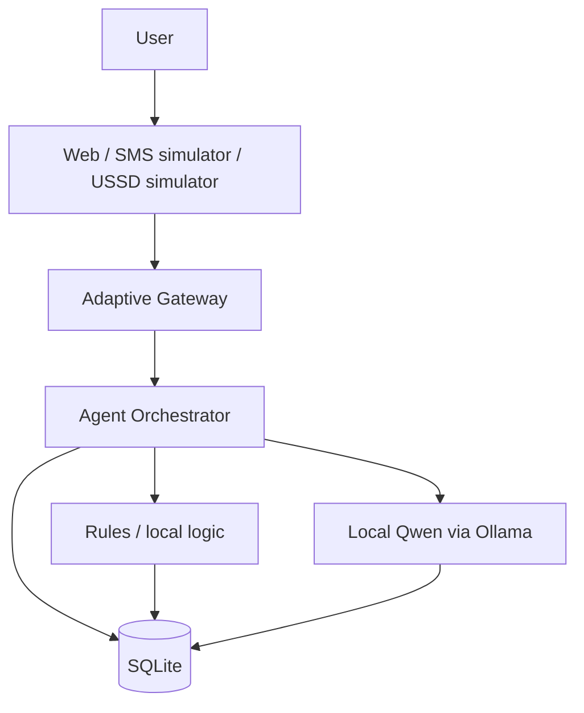
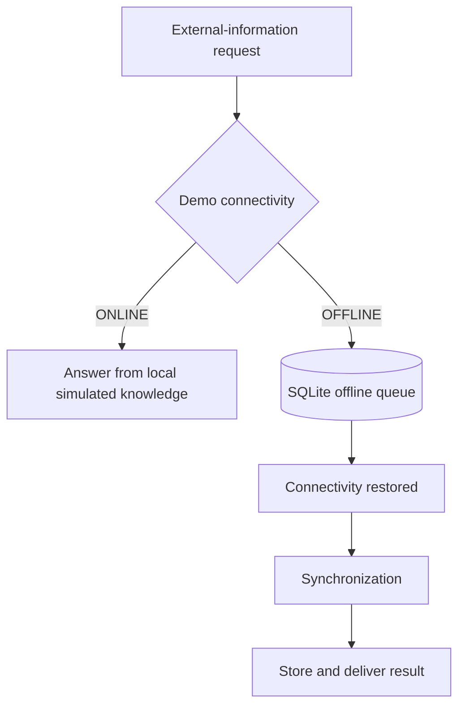

# FikaAI

> **FikaAI is an offline-first, device-agnostic AI agent designed to meet people through the technology they already have — from smartphones and web browsers to SMS and USSD.**

## Problem

Many AI products assume that a user has a smartphone, reliable Internet, affordable mobile data, a modern application, continuous connectivity, and enough digital literacy to navigate that stack.

That assumption leaves an access gap. People who use feature phones, face intermittent or expensive connectivity, or work in low-resource environments are often asked to adapt to tools that were designed for a different context.

Conventional AI interfaces usually require the user to move toward the technology: install an app, stay online, and interact in a rich graphical UI.

FikaAI explores the opposite question:

> **Can AI adapt to the user's available device, connectivity, and communication channel?**

This repository is an MVP prototype of that idea. It does not claim nationwide deployment or production telecom connectivity.

## Proposed Solution

FikaAI separates four concerns:

1. **AI reasoning** — an agent orchestrator with a small-model-first path (rules, then local classifier, then Qwen when needed)
2. **Communication channels** — Web/PWA, an SMS simulator, and a USSD simulator that adapt display only
3. **Local storage** — SQLite on the developer machine
4. **Connectivity management** — a demo ONLINE/OFFLINE switch with a local request queue

Channels produce a normalized internal message. The agent returns a channel-independent reply. The gateway and channel adapters decide how to show that reply.

**Current MVP interfaces**

* Web/PWA
* SMS simulator
* USSD simulator

The architecture is designed so that real SMS, USSD, and eventually voice/IVR integrations can be added later as adapters without rewriting the core agent.

**Offline-first approach in this MVP**

* Simple tasks (record a sale, total sales, help) run locally without a network call
* Local data is stored in SQLite
* Requests that need unavailable external information can be queued
* Queued requests synchronize when the demo connection returns to ONLINE
* Local models can be used through Ollama when configured





### Current Progress

**Implemented in this MVP**

* Working Express backend
* Working PWA/web interface
* Working SMS simulator
* Working USSD simulator
* SQLite persistence
* Agent orchestrator
* Rule-based fast path
* Local keyword classifier for some ambiguous requests
* Local LLM provider abstraction with Ollama/Qwen and a template fallback
* Offline connectivity simulation (ONLINE/OFFLINE switch)
* Offline request queue
* Synchronization on reconnection
* English and Kiswahili foundations (including mixed input handling)
* 21 automated tests passing
* Live smoke testing completed across Web / SMS / USSD / offline sync

**Not in this MVP (planned adapters / future work)**

> Real telecom SMS/USSD and voice/IVR integrations are not part of the current MVP and are planned as future adapters.

Also not included: production hosting, paid gateways, cloud GPUs, vector databases, or broad African-language coverage beyond English and Kiswahili foundations.

### Qwen Integration

FikaAI uses a provider abstraction so the agent can route complex natural-language reasoning to a Qwen model through Ollama while retaining deterministic local handling for simple operations.

```text
Simple request
    ↓
Rules / local logic

More complex request (for example: explain what I recorded)
    ↓
Local LLM / Qwen via Ollama
```

Not every request uses Qwen. Recording a sale or asking for today’s total usually stays on the rules path. Open chat and explanations escalate to the LLM tier.

The current MVP is designed around **local** Qwen inference through Ollama. There is no cloud Qwen API in this repository. If Ollama is unavailable or the configured model is missing, the app continues with a local template provider (`provider: mock`) and records that clearly in activity and reply metadata.

Default development model: `qwen2.5:3b` (override with `OLLAMA_MODEL`).

## Run it

Requirements: Node.js 22 or newer. Ollama is optional for Qwen replies.

```bash
git clone <repository>
cd fikaai
npm install
npm run dev
```

Open http://127.0.0.1:3000

Copy `.env.example` to `.env` only if you want to change a default.

| Variable | Default | Purpose |
| --- | --- | --- |
| `PORT` | `3000` | Local port |
| `HOST` | `127.0.0.1` | Bind address |
| `DATABASE_PATH` | `./data/fikaai.sqlite` | SQLite file |
| `OLLAMA_BASE_URL` | `http://127.0.0.1:11434` | Local Ollama |
| `OLLAMA_MODEL` | `qwen2.5:3b` | Model name passed to Ollama |
| `OLLAMA_ENABLED` | `true` | Set `false` to force the template fallback |
| `DEFAULT_USER_ID` | `demo-user` | Local demo user |
| `CONNECTIVITY_MODE` | `online` | Starting ONLINE/OFFLINE demo mode |

Optional Qwen setup:

```bash
ollama serve
ollama pull qwen2.5:3b
```

Startup logs and `/api/health` report whether Ollama is expected to answer or whether the mock template will be used.

## How to Demonstrate

### Demo 1 — Web

Send:

> I sold three bags of maize for 4500.

Expected result:

> Recorded: maize sale — with quantity and KSh 4,500.

### Demo 2 — SMS

Open the **SMS** tab and ask:

> How much did I sell today?

Expected result:

> Today’s recorded sales are KSh 4,500.

### Demo 3 — USSD

Open the **USSD** tab. The menu starts as:

```text
FIKAAI
1. Ask AI
2. Record information
3. View information
4. Help
```

Choose `3` to view today’s records through the same agent.

### Demo 4 — Offline

1. Switch **ONLINE → OFFLINE**
2. Record a local sale (still works)
3. Ask `What is the market price of maize?` (queues; market data in this MVP is a local sample, gated by the demo switch)
4. Switch **OFFLINE → ONLINE** and confirm the queue synchronizes

### Demo 5 — Qwen

With Ollama running and `qwen2.5:3b` installed, ask:

> Explain what I recorded today.

Check the reply metadata / Activity panel for `provider: ollama` (or the Qwen label). If Ollama is down, the same request still answers via the local template and shows `provider: mock`.

Kiswahili examples: `Nimeuza mifuko 3 ya mahindi kwa 4500`, `Nimeuza ngapi leo?`, `Eleza nilichorekodi leo`.

## Tests

```bash
npm test
```

Covers intent and routing, tools, offline queue and sync, web/SMS/USSD, record CRUD, and an HTTP path from each channel through the gateway to the agent.

## Cost and privacy

Development stays at **KSh 0** recurring infrastructure cost. No paid LLM, SMS, USSD, maps, vector DB, or cloud GPU dependency is required.

The demo stores a local user id, typed messages, and recorded sales in SQLite on this computer. It does not collect phone numbers or real personal profiles. Market prices in the demo are a simulated sample.

See also [`PROBLEM.md`](PROBLEM.md) for the problem statement in submission form.

## Layout

```text
src/server          HTTP API and static PWA
src/gateway         Channel-aware entry point
src/channels        Web, SMS simulator, USSD simulator
src/agent           Rules, local classifier, tools, orchestrator
src/llm             Ollama/Qwen provider and local template
src/offline         Queue sync
src/storage         SQLite
src/i18n            English and Kiswahili strings
public              Web, SMS, and USSD screens
tests               Vitest
PROBLEM.md          Problem statement for H4H
```
