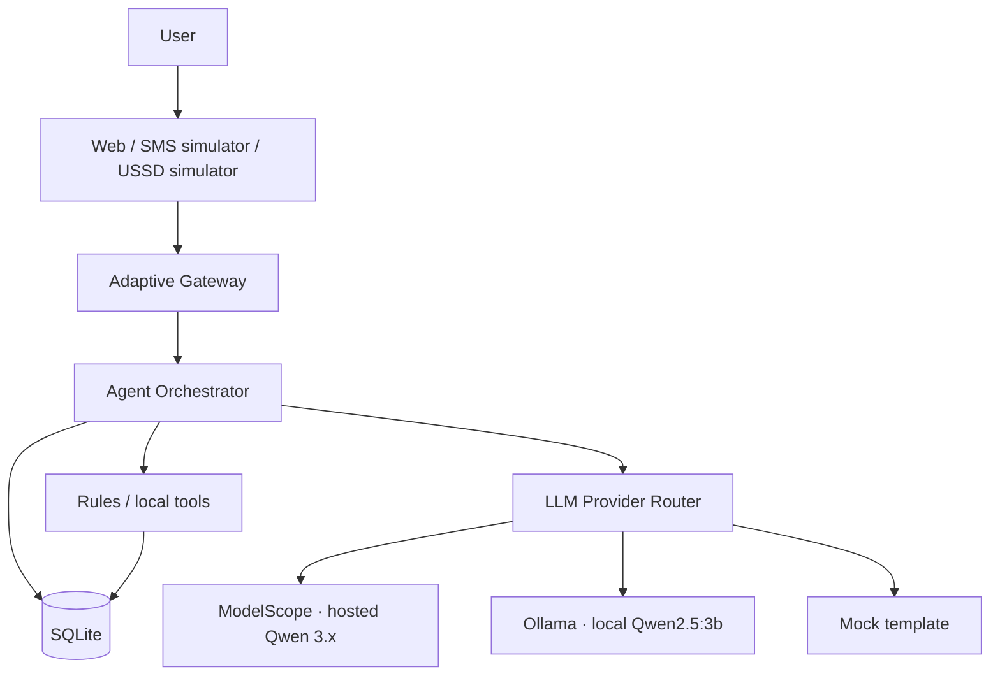
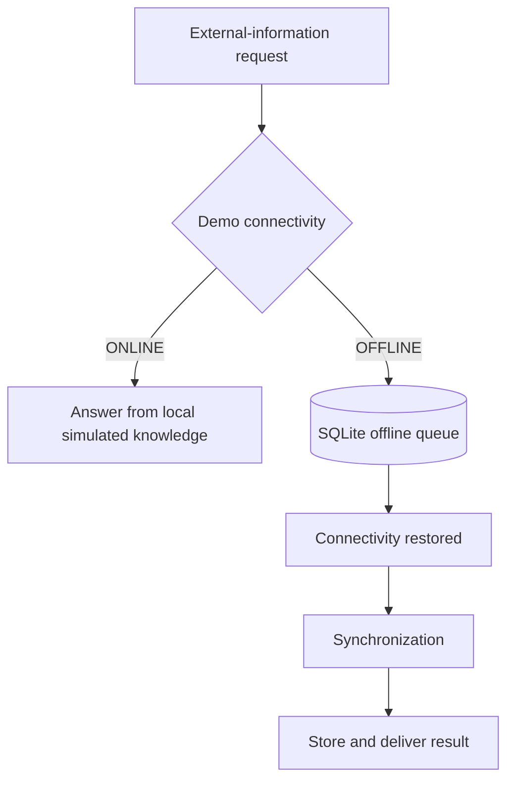

# FikaAI

> **FikaAI is an offline-first, device-agnostic AI agent designed to meet people through the technology they already have — from smartphones and web browsers to SMS and USSD.**

## Problem

Many AI products assume that a user has a smartphone, reliable Internet, affordable mobile data, a modern application, continuous connectivity, and enough digital literacy to navigate that stack.

That assumption leaves an access gap. People who use feature phones, face intermittent or expensive connectivity, or work in low-resource environments are often asked to adapt to tools that were designed for a different context.

Conventional AI interfaces usually require the user to move toward the technology: install an app, stay online, and interact in a rich graphical UI.

FikaAI explores the opposite question:

> **Can AI adapt to the user's available device, connectivity, and communication channel?**

This repository is an MVP prototype of that idea. It does not claim nationwide deployment or production telecom connectivity.

## Proposed Solution

FikaAI separates four concerns:

1. **AI reasoning** — an agent orchestrator with a small-model-first path (rules, then local classifier, then Qwen when needed)
2. **Communication channels** — Web/PWA, an SMS simulator, and a USSD simulator that adapt display only
3. **Local storage** — SQLite on the developer machine
4. **Connectivity management** — a demo ONLINE/OFFLINE switch with a local request queue

Channels produce a normalized internal message. The agent returns a channel-independent reply. The gateway and channel adapters decide how to show that reply.

**Current MVP interfaces**

* Web/PWA
* SMS simulator
* USSD simulator

The architecture is designed so that real SMS, USSD, and eventually voice/IVR integrations can be added later as adapters without rewriting the core agent.

**Offline-first approach in this MVP**

* Simple tasks (record a sale, total sales, help) run locally without a network call
* Local data is stored in SQLite
* Requests that need unavailable external information can be queued
* Queued requests synchronize when the demo connection returns to ONLINE
* Local models can be used through Ollama when configured
* Optional hosted Qwen 3.x models can be used through ModelScope when online and configured



Hosted ModelScope is used only when the demo connection is online and credentials are configured. Offline work continues through rules, tools, local Ollama, and the SQLite queue.



### Current Progress

**Implemented in this MVP**

* Working Express backend
* Working PWA/web interface
* Working SMS simulator
* Working USSD simulator
* SQLite persistence
* Agent orchestrator
* Rule-based fast path
* Local keyword classifier for some ambiguous requests
* Local LLM provider abstraction with Ollama (local Qwen2.5:3b) and optional ModelScope (hosted Qwen 3.x)
* Offline connectivity simulation (ONLINE/OFFLINE switch)
* Offline request queue
* Synchronization on reconnection
* English and Kiswahili foundations (including mixed input handling)
* Automated tests for agent, channels, offline, and provider routing (30 passing)
* Live smoke testing completed across Web / SMS / USSD / offline sync
* Optional ModelScope smoke script (`npm run smoke:modelscope`) verified against hosted Qwen

**Not in this MVP (planned adapters / future work)**

> Real telecom SMS/USSD and voice/IVR integrations are not part of the current MVP and are planned as future adapters.

Also not included: production hosting, paid SMS/USSD gateways, cloud GPUs, vector databases, or broad African-language coverage beyond English and Kiswahili foundations.

### Model Architecture

FikaAI is **not** a model-selector product. Models sit behind a provider abstraction:

```text
FikaAI
  ↓
Agent
  ↓
LLM Provider
  ├── ModelScope → configurable Qwen 3.x (online / high-capability)
  ├── Ollama → Qwen2.5:3b (local / offline)
  └── Mock → local template (tests / last-resort fallback)
```

Principle:

> Hosted Qwen provides higher-capability online intelligence, while local Qwen2.5:3b provides the offline/local fallback.

The four ModelScope models are interchangeable through configuration (`MODELSCOPE_MODEL`). Changing the model does not require changes to the agent, channels, tools, SQLite, or offline queue.

Supported hosted models:

```text
Qwen-Ambassador/Qwen3.7-Max
Qwen-Ambassador/Qwen3.8-Max
Qwen-Ambassador/Qwen3.8-plus
Qwen-Ambassador/Qwen3.7-Plus
```

```text
Simple / local task
    ↓
Rules / local tools
    ↓
No hosted inference needed

Complex explanation / open chat
    ↓
LLM provider
    ↓
ModelScope when online and configured
else Ollama when available
else mock template
```

`LLM_PROVIDER` modes:

| Mode | Behavior |
| --- | --- |
| `auto` | Prefer ModelScope when online + key configured; else Ollama; else mock |
| `ollama` | Local Ollama only (then mock) |
| `modelscope` | Prefer ModelScope; fall back to Ollama, then mock |
| `mock` | Template only (tests / no LLM) |

While the demo connection is **OFFLINE**, ModelScope is never called.

### Qwen Integration

FikaAI uses a provider abstraction so the agent can route complex natural-language reasoning to Qwen while retaining deterministic local handling for simple operations.

Not every request uses an LLM. Recording a sale or asking for today’s total usually stays on the rules path. Open chat and explanations escalate to the LLM tier.

Default local model: `qwen2.5:3b` (`OLLAMA_MODEL`).  
Default hosted model: `Qwen-Ambassador/Qwen3.7-Max` (`MODELSCOPE_MODEL`).

## Run it

Requirements: Node.js 22 or newer. Ollama is optional for local Qwen. ModelScope is optional for hosted Qwen.

```bash
git clone <repository>
cd fikaai
cp .env.example .env
# Edit .env if you want ModelScope: set MODELSCOPE_API_KEY (never commit .env)
npm install
npm run dev
```

Open http://127.0.0.1:3000

| Variable | Default | Purpose |
| --- | --- | --- |
| `PORT` | `3000` | Local port |
| `HOST` | `127.0.0.1` | Bind address |
| `DATABASE_PATH` | `./data/fikaai.sqlite` | SQLite file |
| `OLLAMA_BASE_URL` | `http://127.0.0.1:11434` | Local Ollama |
| `OLLAMA_MODEL` | `qwen2.5:3b` | Local Qwen model |
| `OLLAMA_ENABLED` | `true` | Set `false` to skip Ollama |
| `MODELSCOPE_BASE_URL` | `https://api-inference.modelscope.ai/v1` | Hosted OpenAI-compatible API |
| `MODELSCOPE_API_KEY` | _(empty)_ | Set in local `.env` only |
| `MODELSCOPE_MODEL` | `Qwen-Ambassador/Qwen3.7-Max` | Hosted model from the allowlist |
| `LLM_PROVIDER` | `auto` | `auto` \| `ollama` \| `modelscope` \| `mock` |
| `DEFAULT_USER_ID` | `demo-user` | Local demo user |
| `CONNECTIVITY_MODE` | `online` | Starting ONLINE/OFFLINE demo mode |

**Never commit `.env`.** Never put the API key in README, frontend, logs, or `/api/health`.

Optional local Qwen:

```bash
ollama serve
ollama pull qwen2.5:3b
```

Optional hosted smoke (uses ModelScope credits):

```bash
npm run smoke:modelscope
```

Optional four-model evaluation (uses more credits):

```bash
npm run eval:qwen
```

`GET /api/health` and `GET /api/llm/models` expose safe provider/model status without secrets.

## How to Demonstrate

```text
1. Start Ollama (optional for local Qwen).
2. Start FikaAI (`npm run dev`).
3. Confirm `/api/health` shows Ollama and/or ModelScope readiness.
4. Configure `MODELSCOPE_API_KEY` in `.env` if testing hosted Qwen.
5. Optionally set `MODELSCOPE_MODEL` (or use the small Hosted model control when a key is configured).
6. Exercise Web / SMS / USSD with the same sale/query flows.
7. Switch connectivity to OFFLINE — local rules and Ollama still work; ModelScope is not called.
8. Queue an external-information request while offline.
9. Restore ONLINE and confirm synchronization.
10. For an LLM turn, ask “Explain what I recorded today.” and check `provider` / `model` in the reply metadata.
```

This demonstrates:

```text
same FikaAI agent
      ↓
different connectivity
      ↓
different LLM implementation
      ↓
same user experience
```

### Demo 1 — Web

Send:

> I sold three bags of maize for 4500.

Expected result:

> Recorded: maize sale — with quantity and KSh 4,500.

### Demo 2 — SMS

Open the **SMS** tab and ask:

> How much did I sell today?

### Demo 3 — USSD

Open the **USSD** tab and choose `3` to view today’s records.

### Demo 4 — Offline

1. Switch **ONLINE → OFFLINE**
2. Record a local sale (still works)
3. Ask `What is the market price of maize?` (queues)
4. Switch **OFFLINE → ONLINE** and confirm sync

### Demo 5 — Local or hosted Qwen

Ask:

> Explain what I recorded today.

Check Activity / reply metadata for `provider: ollama`, `provider: modelscope`, or `provider: mock`.

Kiswahili examples: `Nimeuza mifuko 3 ya mahindi kwa 4500`, `Nimeuza ngapi leo?`, `Eleza nilichorekodi leo`.

## Tests

```bash
npm test
```

Covers intent and routing, tools, offline queue and sync, web/SMS/USSD, record CRUD, provider routing (including offline ModelScope skip), and an HTTP path from each channel through the gateway to the agent.

## Cost and privacy

Local development can stay at **KSh 0** recurring infrastructure cost: Ollama + SQLite + simulators. ModelScope is optional and consumes hosted inference credits when used.

The demo stores a local user id, typed messages, and recorded sales in SQLite. It does not collect phone numbers or real personal profiles. Market prices in the demo are a simulated sample.

See also [`PROBLEM.md`](PROBLEM.md).

## Layout

```text
src/server          HTTP API and static PWA
src/gateway         Channel-aware entry point
src/channels        Web, SMS simulator, USSD simulator
src/agent           Rules, local classifier, tools, orchestrator
src/llm             ModelScope, Ollama, mock providers + router
src/offline         Queue sync
src/storage         SQLite
src/i18n            English and Kiswahili strings
scripts             Optional ModelScope smoke / eval
public              Web, SMS, and USSD screens
tests               Vitest
PROBLEM.md          Problem statement for H4H
```