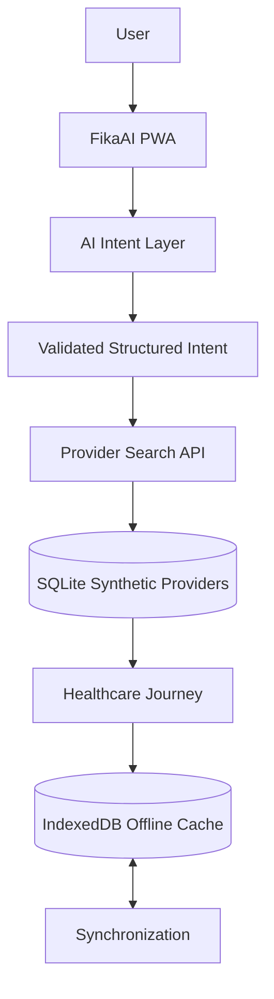

# FikaAI

## Healthcare access that works when connectivity doesn't.

A care-navigation prototype that helps people discover relevant healthcare provider options and keep their journey available when connectivity is unreliable.

This is **not** a medical diagnosis system, a replacement for doctors, a live national healthcare network, or a clinical decision tool.

### Problem

People often need specialist care but cannot assume continuous connectivity. Travelling across a city only to learn that a referral is required — or that a facility cannot help that day — wastes time, money, and trust. Care-navigation information is also easy to lose when the network drops mid-journey.

### Solution

FikaAI helps a user:

* express a healthcare need in natural language
* discover relevant provider options from a local synthetic directory
* understand facility requirements (appointment / referral)
* save a lightweight healthcare journey
* continue reviewing that journey when connectivity disappears
* synchronize pending actions when connectivity returns
* leave simple feedback

### MVP

Features actually implemented in this repository:

* Natural-language care search with structured AI intent extraction
* Deterministic provider search over synthetic SQLite provider records
* Facility detail (specialist, availability note, appointment/referral flags, last-updated timestamp, demo-data badge)
* Healthcare journey creation and persistence
* Offline continuity via service worker shell cache + IndexedDB journey cache
* Browser online/offline detection and reconnect sync (`pending` → `syncing` → `synced` / `failed`)
* Simple feedback capture (`yes` / `partly` / `no`)
* Emergency-language safety message (no diagnosis)
* AI failure fallback via deterministic keyword intent mapping
* SMS / USSD simulators retained as secondary channels

### How AI Is Used

| Item | Detail |
| --- | --- |
| Hosted model | ModelScope OpenAI-compatible API — configurable Qwen 3.x (default `Qwen-Ambassador/Qwen3.7-Max`) |
| Local model | Ollama `qwen2.5:3b` (optional) |
| Fallback | Deterministic specialty/location keyword mapping + mock last resort |
| Selection | `LLM_PROVIDER=auto\|ollama\|modelscope\|mock` |

Flow:

1. User enters a natural-language request
2. AI (when available) returns structured intent JSON
3. Intent is validated before use
4. Application runs a deterministic SQL/provider-directory query
5. Results shown to the user come from stored provider records

> AI is used for intent understanding, not autonomous medical diagnosis or generation of provider availability.

AI does **not** invent hospitals, doctors, availability, medicines, or diagnoses.

### Offline Architecture

* **Service worker** caches the PWA shell (`index.html`, CSS, JS, manifest, icon)
* **IndexedDB** stores the active journey, provider snapshot, pending actions, and recent search cache
* **Offline mode** shows a clear Offline status and keeps the saved journey readable
* **Pending actions** (for example an offline note) are stored locally and marked `pending`
* **Reconnect** listens for the browser `online` event, shows synchronizing state, then marks `synced` (or `failed` with retry)
* Backend demo connectivity toggle remains available for secondary channel/API demos

### Data

> The provider records used in this prototype are synthetic demonstration data. They do not represent verified live hospital availability.

Each record includes a demo-data indicator and a last-updated label (`27 Sep 2026, 09:30 EAT`).

### Responsible AI

* No autonomous diagnosis
* Emergency language triggers a redirect-to-care message, not a clinical assessment
* Provider records are the source of truth for facility facts
* Synthetic provider data is clearly labeled
* Minimal data collection — do not enter sensitive medical information
* Offline journey state remains on-device until sync
* Documented limitations: prototype scope, synthetic directory, optional AI providers

### Architecture


```mermaid
flowchart TD
  User --> PWA[FikaAI PWA]
  PWA --> Intent[AI Intent Layer]
  Intent --> Validated[Validated Structured Intent]
  Validated --> Search[Provider Search API]
  Search --> DB[(SQLite Synthetic Providers)]
  DB --> Journey[Healthcare Journey]
  Journey --> IDB[(IndexedDB Offline Cache)]
  IDB <--> Sync[Synchronization]
```

### Installation

Requirements: Node.js 22+.

```bash
cp .env.example .env
npm install
npm run seed
npm run dev
```

Open http://127.0.0.1:3000

Optional local AI:

```bash
ollama serve
ollama pull qwen2.5:3b
```

Optional hosted AI smoke (requires `MODELSCOPE_API_KEY` in local `.env`):

```bash
npm run smoke:modelscope
```

Force re-seed:

```bash
node scripts/seed.js --force
```

### Environment Variables

See `.env.example`. Never commit real secrets.

| Variable | Default | Purpose |
| --- | --- | --- |
| `PORT` | `3000` | Local port |
| `HOST` | `127.0.0.1` | Bind address |
| `DATABASE_PATH` | `./data/fikaai.sqlite` | SQLite file |
| `OLLAMA_BASE_URL` | `http://127.0.0.1:11434` | Local Ollama |
| `OLLAMA_MODEL` | `qwen2.5:3b` | Local model |
| `OLLAMA_ENABLED` | `true` | Enable/disable Ollama |
| `MODELSCOPE_BASE_URL` | ModelScope inference URL | Hosted API |
| `MODELSCOPE_API_KEY` | _(empty)_ | Hosted key — local `.env` only |
| `MODELSCOPE_MODEL` | `Qwen-Ambassador/Qwen3.7-Max` | Hosted model allowlist entry |
| `LLM_PROVIDER` | `auto` | `auto` \| `ollama` \| `modelscope` \| `mock` |
| `DEFAULT_USER_ID` | `demo-user` | Local demo user |
| `CONNECTIVITY_MODE` | `online` | Demo backend online/offline start mode |

### Testing

```bash
npm test
```

Latest run in this repository: **40 passed / 40 total** across agent, channels, offline queue, data, LLM provider, e2e, and healthcare suites.

Healthcare coverage includes intent fallback, malformed AI rejection, emergency safety, provider search, journey create, pending action, sync, feedback, and offline-backend search fallback.

### Demo

Recommended sequence:

1. Open http://127.0.0.1:3000
2. Enter: `I need a cardiologist in Nairobi.`
3. Show structured intent and provider results (demo-data badges)
4. Open a facility and review requirements / last updated
5. Start healthcare journey
6. Disable network (DevTools Offline or Wi‑Fi off)
7. Confirm Offline status and saved journey still available
8. Save an offline note (pending)
9. Restore network → synchronizing → synced
10. Submit feedback

See also:

* [`docs/JUDGE_WALKTHROUGH.md`](docs/JUDGE_WALKTHROUGH.md)
* [`docs/HACKATHON_DEMO_CHECKLIST.md`](docs/HACKATHON_DEMO_CHECKLIST.md)
* [`docs/DEMO_RECORDING_PLAN.md`](docs/DEMO_RECORDING_PLAN.md)

### Layout

```text
src/healthcare     Intent, safety, synthetic providers, care flow
src/server         HTTP API + static PWA
src/llm            ModelScope / Ollama / mock router
src/storage        SQLite schema + repository
src/offline        Legacy channel queue sync
src/channels       SMS / USSD simulators (secondary)
public             Care-first PWA (IndexedDB + service worker)
scripts/seed.js    Demo provider seeding
tests              Vitest
docs               Submission / demo materials
```
